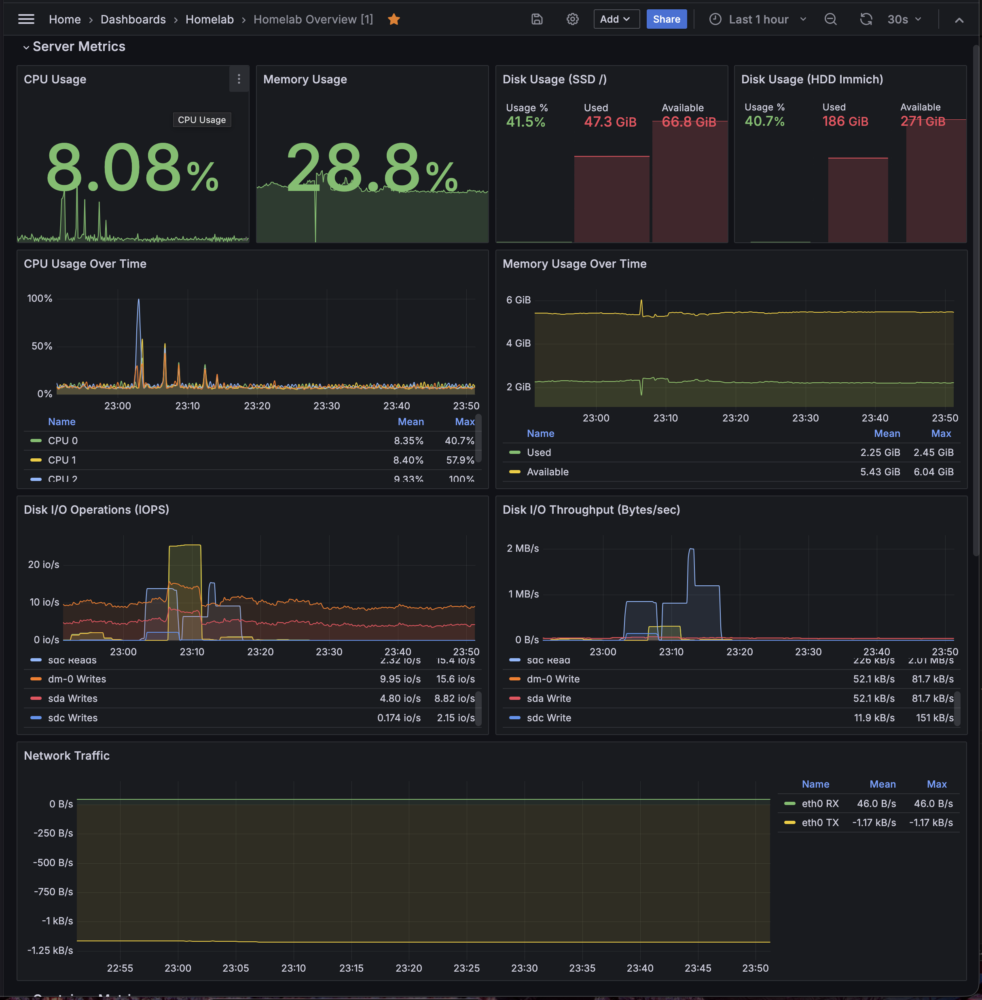
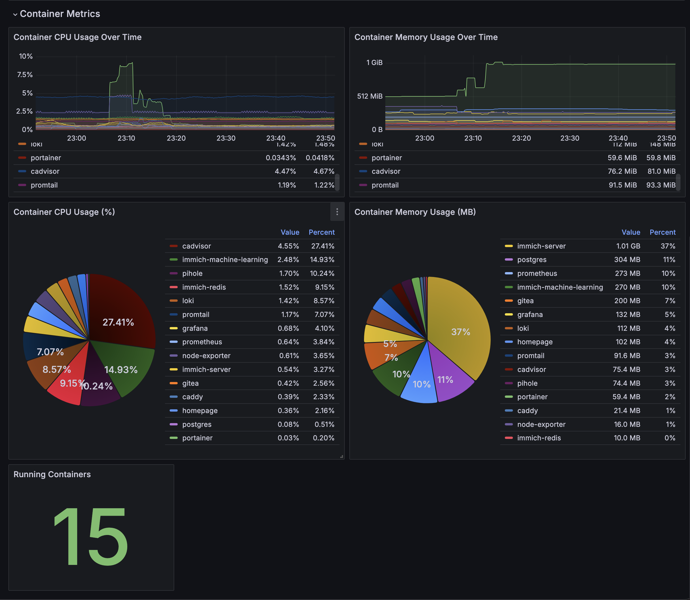

# Monitoring Stack

Complete monitoring solution for homelab-01 using Prometheus, Grafana, and Loki.

## Services

| Service | Purpose | Port |
|---------|---------|------|
| Prometheus | Metrics collection and storage | 9091 |
| Grafana | Visualization and dashboards | 3002 |
| Loki | Log aggregation | 3100 (internal) |
| Promtail | Log shipping agent | - |
| Node Exporter | Host system metrics | 9100 (internal) |
| cAdvisor | Container metrics | 8081 |

## Architecture

```
┌─────────────────────────────────────────────────────┐
│                    monitoring-net                    │
│                                                      │
│  ┌─────────────┐   ┌──────────┐   ┌──────────────┐ │
│  │ Prometheus  │◄──│ cAdvisor │   │ Node Exporter│ │
│  │   :9091     │   │  :8081   │   │    :9100     │ │
│  └──────┬──────┘   └──────────┘   └──────────────┘ │
│         │                                           │
│         │         ┌──────────┐                      │
│         │         │   Loki   │◄─────┐               │
│         │         │  :3100   │      │               │
│         ▼         └────┬─────┘      │               │
│  ┌─────────────┐       │       ┌────┴─────┐        │
│  │   Grafana   │◄──────┘       │ Promtail │        │
│  │   :3002     │               │ (logs)   │        │
│  └─────────────┘               └──────────┘        │
└─────────────────────────────────────────────────────┘
```

## Quick Start

1.**Configure environment**:
   ```bash
   # Copy and edit the .env file
   cp ../../config/env-templates/monitoring.env.example .env
   # Edit .env and set a secure GRAFANA_ADMIN_PASSWORD
   ```

2.**Start the stack**:
   ```bash
   docker compose up -d
   ```

3.**Access services**:
   - Grafana: http://localhost:3002 (admin / your_password)
   - Prometheus: http://localhost:9091
   - cAdvisor: http://localhost:8081

## Configuration

### Prometheus Scrape Targets

Edit `prometheus/prometheus.yml` to add or modify scrape targets:

```yaml
scrape_configs:
  - job_name: "my-service"
    static_configs:
      - targets: ["service:port"]
```

### Loki Retention

Default retention is 7 days. Edit `loki/loki-config.yaml` to change:

```yaml
limits_config:
  retention_period: 168h  # 7 days
```

### Adding Dashboards

Place JSON dashboard files in `grafana/provisioning/dashboards/json/`.
Grafana will automatically load them.

## Pre-configured Features

### Datasources
- **Prometheus**: Default datasource for metrics
- **Loki**: Log datasource for container and system logs

### Dashboards
- **Homelab Overview**: System metrics, container stats, and network traffic

## Grafana Dashboards

**Server Metrics Dashboard:**



*Real-time monitoring of CPU, memory, disk usage, and system load*

**Container Metrics Dashboard:**



*Docker container resource usage, CPU, memory, and network statistics*

## Memory Usage

Estimated memory usage for the monitoring stack:

| Service | Approx. RAM |
|---------|-------------|
| Prometheus | 200-400 MB |
| Grafana | 100-200 MB |
| Loki | 200-300 MB |
| Promtail | 50-100 MB |
| Node Exporter | 20-30 MB |
| cAdvisor | 100-200 MB |
|**Total** |**~700-1200 MB** |

## Troubleshooting

### Prometheus targets not showing

1. Check Prometheus is running: `docker ps | grep prometheus`
2. Verify targets: http://localhost:9091/targets
3. Check network connectivity between containers

### Logs not appearing in Loki

1. Check Promtail is running: `docker ps | grep promtail`
2. Verify Promtail can access Docker socket
3. Check Loki is ready: http://localhost:3100/ready

### Grafana dashboard not loading

1. Check datasource connection in Grafana settings
2. Verify Prometheus/Loki are accessible from Grafana container
3. Check browser console for errors

## Useful Queries

### Prometheus (Metrics)

```promql
# CPU usage percentage
100 - (avg(irate(node_cpu_seconds_total{mode="idle"}[5m])) * 100)

# Memory usage percentage
(1 - (node_memory_MemAvailable_bytes / node_memory_MemTotal_bytes)) * 100

# Disk usage percentage
(1 - (node_filesystem_avail_bytes{mountpoint="/"} / node_filesystem_size_bytes{mountpoint="/"})) * 100

# Container CPU usage
sum(rate(container_cpu_usage_seconds_total{name!=""}[5m])) by (name) * 100

# Container memory usage
container_memory_usage_bytes{name!=""}
```

### Loki (Logs)

```logql
# All container logs
{job="docker"}

# Logs from specific container
{container="immich-server"}

# Error logs
{job="docker"} |= "error"

# System auth logs
{job="auth"}
```

## Stopping the Stack

```bash
docker compose down
```

To remove all data (volumes):

```bash
docker compose down -v
```
